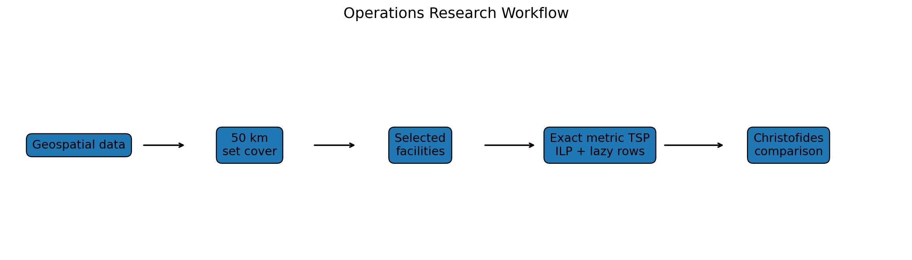
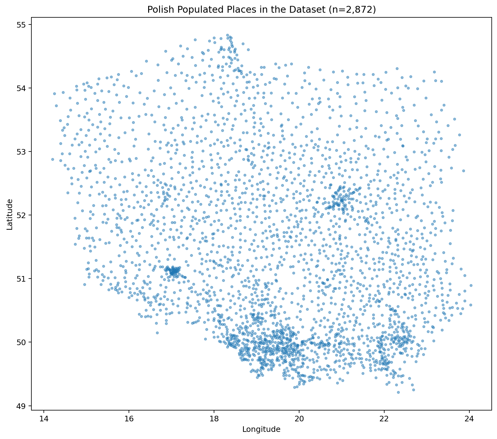
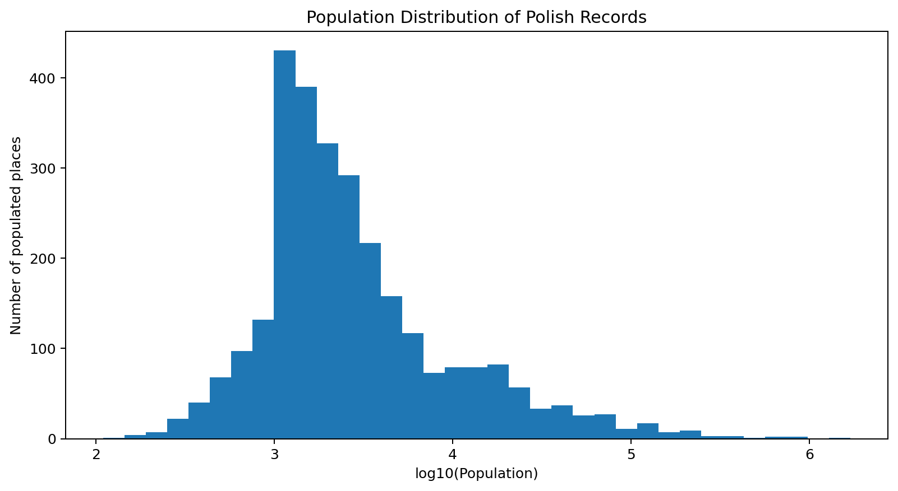
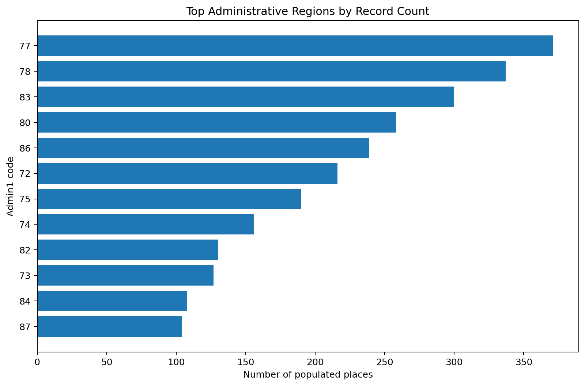
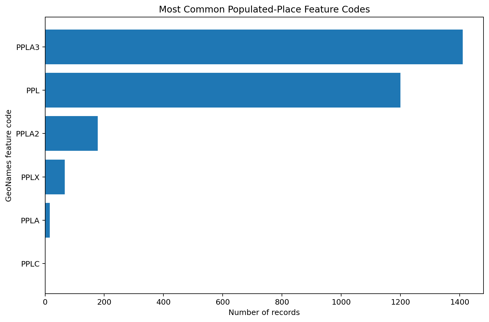

# Operations Research in Poland

**Facility Location · Metric TSP · Lazy Row Generation · Christofides Approximation**

[](https://www.kaggle.com/code/perpendicooler/operations-research-in-poland)


This repository contains a geospatial Operations Research study built around a hypothetical market-expansion problem for **Steamboat Willie's** in Poland.

The project connects three classical optimization tasks:

1. **Minimum set covering / facility location** — choose the fewest candidate store locations needed so every Polish populated place represented in the dataset lies within a 50 km great-circle radius of at least one store.
2. **Exact Metric Traveling Salesman Problem** — compare an explicit subtour-elimination ILP with an iterative lazy-row-generation formulation.
3. **Christofides approximation** — compare a polynomial-time metric-TSP approximation against exact ILP benchmarks.

<p align="center">
  
</p>

## Dataset

The repository includes a cleaned Poland-only extract:

`data/poland_towns_from_dataset.csv`

The processed file contains **2,872 Polish populated-place records with coordinates**, derived from the supplied project dataset. The model uses each populated place both as a demand point and as a candidate facility location.

Main fields:

- `geoname_id`
- `name`
- `feature_code`
- `population`
- `admin1_code`
- `admin2_code`
- `latitude`
- `longitude`

<p align="center">
  
</p>

> **Distance assumption:** all location and TSP distances are Haversine great-circle distances. A 50 km great-circle radius is not equivalent to 50 km of driving distance.

## Task 1 — 50 km Store Coverage

The first model is a binary minimum set-covering problem.

For candidate location \(j\),

\[
x_j =
\begin{cases}
1 & \text{if a store is opened at } j,\\
0 & \text{otherwise.}
\end{cases}
\]

The model minimizes:

\[
\min \sum_j x_j
\]

subject to:

\[
\sum_j a_{ij}x_j \ge 1 \qquad \forall i,
\]

where \(a_{ij}=1\) if candidate \(j\) is within 50 km of demand point \(i\).

The notebook reports both the best feasible solution and the solver's optimality certificate. A store count is described as **optimal only when the MIP solver proves optimality**.

## Task 2 — Exact Metric TSP

For the selected store locations, the symmetric TSP uses binary edge variables:

\[
\min \sum_{i<j} d_{ij}x_{ij}
\]

with degree constraints:

\[
\sum_j x_{ij} = 2 \qquad \forall i.
\]

To eliminate disconnected cycles, the DFJ subtour inequalities are:

\[
\sum_{i<j;\ i,j\in S} x_{ij} \le |S|-1.
\]

Two exact strategies are compared:

- **Explicit SEC formulation** — generate the exponential subtour family for small benchmark instances.
- **Lazy row generation** — solve, detect subtours, add only violated rows, and repeat.

This comparison is designed to illustrate why row generation is much more scalable than constructing the full exponential model in advance.

## Task 3 — Christofides Approximation

Christofides' algorithm follows:

1. Minimum spanning tree
2. Odd-degree vertex identification
3. Minimum-weight perfect matching
4. Eulerian multigraph
5. Euler circuit
6. Metric shortcutting

For metric TSP instances, Christofides guarantees:

\[
L_C \le \frac{3}{2}L^*.
\]

The notebook compares the empirical ratio:

\[
\frac{L_C}{L^*}
\]

against the exact ILP optimum on the benchmark instances.

## Data Exploration

<p align="center">
  
</p>

<p align="center">
  
</p>

<p align="center">
  
</p>

## Repository Structure

```text
operations-research-in-poland/
├── README.md
├── requirements.txt
├── .gitignore
├── dataset_summary.json
├── assets/
│   ├── 01_poland_towns_map.png
│   ├── 02_population_distribution.png
│   ├── 03_top_regions_by_record_count.png
│   ├── 04_feature_code_distribution.png
│   └── 05_project_pipeline.png
├── data/
│   ├── README.md
│   └── poland_towns_from_dataset.csv
├── notebooks/
│   └── operations-research-in-poland.ipynb
├── results/
│   └── README.md
└── scripts/
    └── build_result_charts.py
```

## Reproducing the Analysis

The easiest path is the Kaggle notebook:

**[Operations Research in Poland — Kaggle](https://www.kaggle.com/code/perpendicooler/operations-research-in-poland)**

For local execution:

```bash
python -m venv .venv
source .venv/bin/activate       # Linux/macOS
# .venv\Scripts\activate      # Windows

pip install -r requirements.txt
jupyter notebook notebooks/operations-research-in-poland.ipynb
```

## Result Assets

The Kaggle notebook exports tabular results such as:

- `selected_store_locations.csv`
- `coverage_validation.csv`
- `tsp_exact_method_comparison.csv`
- `christofides_vs_exact.csv`
- `assignment_task_summary.csv`

Place those CSVs in `results/` and run:

```bash
python scripts/build_result_charts.py
```

The script will generate GitHub-ready result figures inside `assets/results/`, including:

- 50 km coverage map
- nearest-store distance histogram
- explicit-vs-lazy runtime comparison
- explicit-vs-lazy subtour-constraint comparison
- exact-vs-Christofides tour-length comparison
- Christofides approximation-ratio chart

## Methodological Caution

This is a geospatial optimization study, not a complete commercial site-selection model.

A real store expansion decision would also need road-network travel times, customer demand, property cost, competition, facility capacity, operating costs, store-level revenue, and accessibility constraints.

Likewise, the TSP assumes symmetric metric distances, one tour, and no vehicle capacities or time windows.

## Natural OR Extension

A stronger next-stage model is a **Location-Routing Problem (LRP)** that jointly optimizes facility decisions and route cost:

\[
\min \; \text{facility opening cost} + \text{routing cost}
\]

subject to coverage, capacity, assignment, routing, and budget constraints.

## Notebook

The full implementation is available in:

`notebooks/operations-research-in-poland.ipynb`

and on Kaggle via the badge above.
